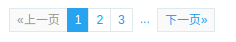
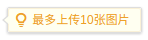

### SUI实战笔记

- 布局 `.sui-row-fluid` 流式栅格系统
  - `.span4`为总宽度的4/12
- 步骤 `div.sui-steps` 
  - 每个步骤 `div.wrap`
  - 状态 `.finished` `.current` `.todo`
- 面包屑 `ul.sui-breadcrumb`
  - 状态 `.active`
- 导航栏 `div.sui-navbar`
  - 深色主题 `.navbar-inverse`
  - 状态 `.active`
- 表单 `form.sui-form`
  - 每一栏 `div.control-group`
  - 标签 `label.control-label`
  - 内容 `div.controls`
- 按钮 `button.sui-btn`或者`a.sui-btn` 
  - 颜色 `btn-primary` `btn-danger`...
  - 大小 `btn-large` `btn-small`...
- 浮动 `.pull-left` `.pull-right`
- 清除浮动 `.clearfix`
```css
.clearfix:before, .clearfix:after {
    display: table;
    content: "";
    line-height: 0;
}
```
- 分页 `div.sui-pagination`
  - 位置 `.pagination-right`
  - 状态 `.diable`
  - 方向 `li.prev` `li.next`
  - 省略 `li.dotted`

  
```html
<div class="sui-pagination">
  <ul>
    <li class="prev disabled"><a href="#">«上一页</a></li>
    <li class="active"><a href="#">1</a></li>
    <li><a href="#">2</a></li>
    <li><a href="#">3</a></li>
    <li class="dotted"><span>...</span></li>
    <li class="next"><a href="#">下一页»</a></li>
  </ul>
</div>
```

- 提醒 `div.sui-msg`
  - 颜色 `.msg-tips` `.msg-error` `.msg-info` ...
  - 图标 `.msg-icon`
  - 块级 `.msg-block`

  
```html
<!-- HTML  -->
<div class="sui-msg msg-tips">
  <div class="msg-con">
  最多上传10张图片
  </div>
  <s class="msg-icon"></s>
</div>
```
```css
/* CSS */
.sui-msg {
    box-shadow: 0 1px 3px rgba(0,0,0,.2);
    border: 1px solid #ddd;
    border-radius: 2px;
}
.sui-msg:before {
    content: "";
    display: inline-block;
    position: absolute;
    border-color: transparent;
    border-style: solid;
    border-width: 5px 6px;
    border-right-color: #ddd;
    left: -12px;
    top: 7px;
}
.sui-msg:after {
    content: "";
    display: inline-block;
    position: absolute;
    border-color: transparent;
    border-style: solid;
    border-width: 5px 6px;
    border-right-color: #fffff1;
    left: -10px;
    top: 7px;
}
```

### SUI学习总结

两天的SUI学习过程中，我对SUI有了更加深刻的理解

- 优点
  - 设计精美且合理，降低开发对开发者设计方面的要求
  - 简单易用，并且开源，可以自行根据所需进行修改
  - 对开发者CSS的深入理解要求不高，增加开发速度
  - CSS类名设置合理，并且模块化程度高
- 缺点
  - 官网的功能有欠缺，不够用心
  - 更新不频繁，功能相对较少
  - 根据淘宝风格定制，不具有普遍适用性
  - 对开发者的能力提高没有任何帮助
  
**总结**
1. 用框架有利有庇，想有提高不能过多地依赖框架，但也不要完全远离框架。
2. 理解一个框架必须要学习框架的设计理念，和看源代码
3. 想要有提高，必须要重视基础
  